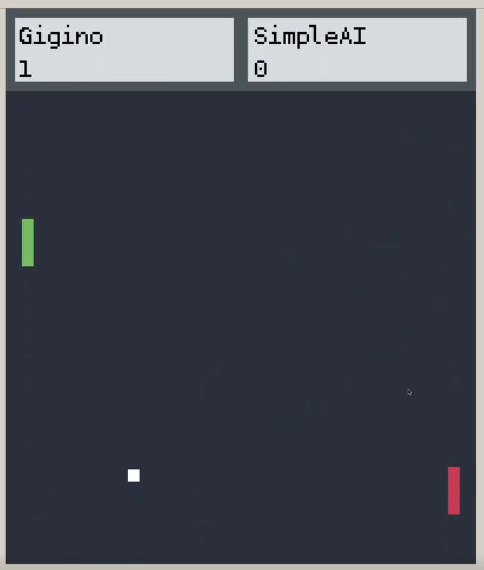

# Deep Q-Learning for Wimblepong
The project was developed during the Reinforcment Course at Aalto University. The goal of the project was to develop an agent able to play Wimblepong a modified version of pong that allows to play with multiple players. 

    

## The network
It was decide use the following network

    

for develpoing the Deep Q-Learning Algorithm. The agent was able to beat the SimpleAI more than 70% of the times only after few thousand of episodes.
